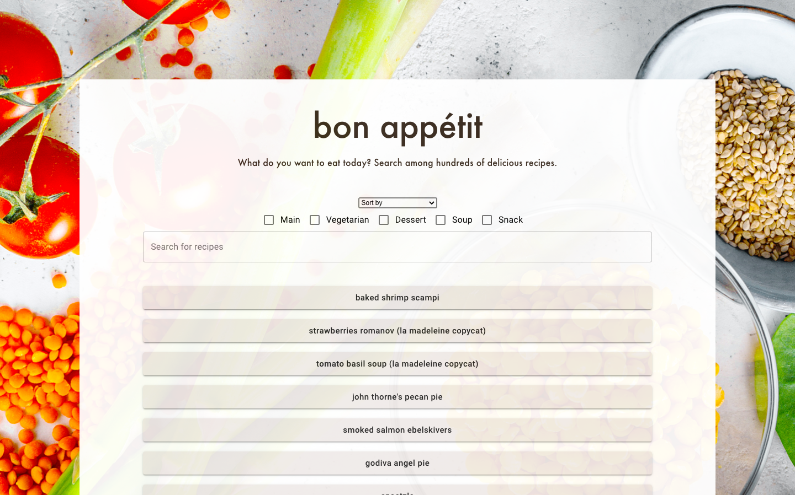
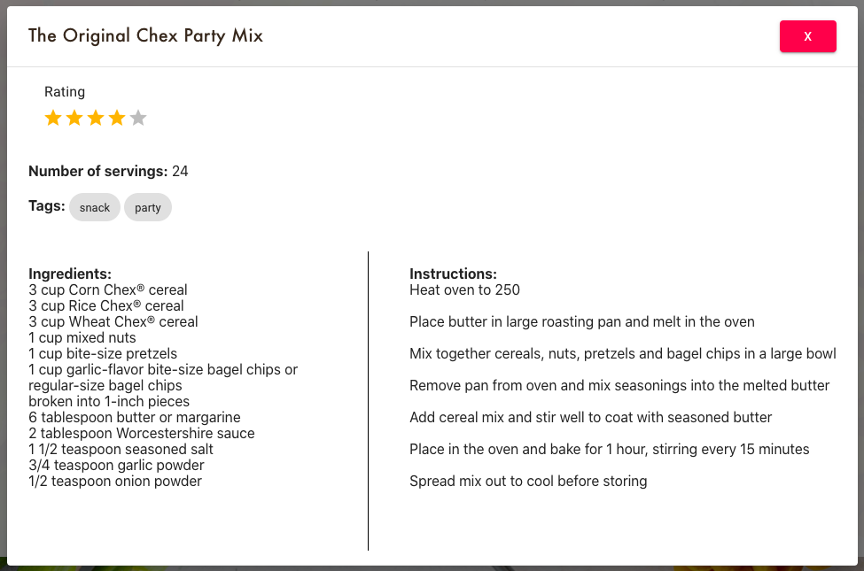
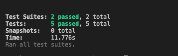
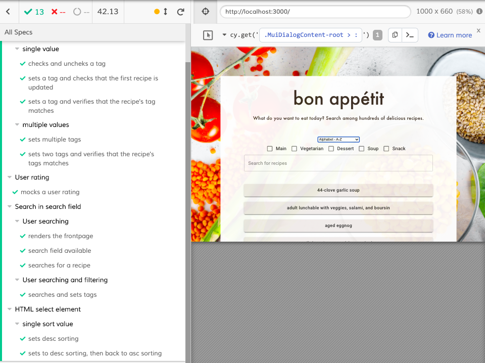

# Bon Appétit - IT2810 Prosjekt 3

## Funksjonalitet

Bon appétit er en nettapplikasjon som gir mulighet til å søke blant hundrevis av oppskrifter. For å finne ønsket oppskrift kan brukeren både søke, sortere og filtrere. Oppskriftene presenteres med navn i listeform, og kan trykkes på for å få mer informasjon om ingredienser, fremgangsmåte og antall porsjoner. Her har også brukeren mulighet til å legge til en "rating" av oppskriften.
Applikasjonen støtter søk etter oppskrifts-navn, filtrering basert på type, samt alfabetisk sortering etter navn, og sortrering på antall porsjoner.

Det er også implementert funksjonalitet for brukergenerert rating av oppskriftene, dette blir gjort på en intuitiv måte ved å klikke på det antallet stjerner brukeren mener oppskriften fortjener. Vurderingen lagres deretter persistent i databasen. Ratingen som vises er siste rating som er lagt inn av en bruker. Dersom en oppskrift ikke har noen rating betyr det at ingen har ratet oppskriften enda.

Prosjektet bruker den populære MERN-stacken: MongoDB, Express(.js), React(.js) og Node(.js).

Brukergrensesnitt er basert på React med Typescript, og prosjektet er initialisert med `create-react-app --typescript`.

Serversiden (backend) er basert på Node, Express og MongoDB. Alt av sortering, filtrering og søk løses i backend ved kall til databasen, og gjøres på hele resultatsettet.  

# Kjøre prosjektet

For å kunne kjøre prosjektet og hente data må man være koblet til NTNU-nett, enten gjennom eduroam eller VPN. 
Server og klient startes hver for seg.

### Server

Prosjektet er implementert med `nodemon` som er et verktøy som gjør det enklere å utvikle node.js baserte applikasjoner ved å automatisk restarte serveren ved eventuelle endringer i koden. For å kunne kjøre server-siden av prosjektet må man  gjøre følgende:

- `npm install -g nodemon`
- `npm install ts-node` 

Fra filen `server/server.ts` skriv `nodemon server` i kommandolinjen for å starte serveren på port 4000.

### Klient

Nå serveren kjører kan man starte klientsiden ved å først skrive `npm install`, og deretter `npm start`

Fungerer ikke dette er det mulig at du ikke har node installert. Det kan du installere her: https://nodejs.org/en/download/

  

# Frontend

Brukergrensesnittet er basert på React, Typescript og Redux. React og Typescript er valgt på bakgrunn av kravspesifikasjonene, mens Redux ble valgt da ingen av gruppemedlemmene hadde erfaring med noen form for state management, og etter å ha undersøkt de forskjellige mulighetene satt vi igjen med inntrykk av at det var lettere å komme i gang med.

  

## Redux

For tilstandshåndtering har vi valgt å implementere prosjektet med Redux. Dette er hensiktsmessig siden applikasjonen skal støtte ulike former for brukerinteraksjon, samt at vi har valgt å dele applikasjonen inn i mange ulike komponenter. Applikasjonen inneholder mange datasett som endres seg fortløpende som følger av brukerinteraksjonen, og vi så det derfor hensiktsmessig å benytte oss av Redux. 

Ved bruk av en state manager som Redux er det enkelt å håndtere forandringer av tilstand på de ulike datasettene, og sende dette rundt i applikasjonen til de komponentene som har bruk for informasjonen til enhver tid.

I `src/components/store/types/types.ts` ligger de ulike handlingene som kan utføres. Dette er henholdvis handlinger tilknyttet søk, filtrering og sortering av datasettet. Ved hjelp av Redux kan vi enkelt sende nåværende tilstand rundt i applikasjonen, og igjen hente dette ut på serversiden. 

Vi har også benyttet Redux for å implementere pagination, slik at brukeren enkelt kan bla i datasettet uten at applikasjonen oppleves som treg. 

Alle Redux-komponentene ligger i mappen `store`.

-  `src/store/actions/actions.ts` inneholder funksjoner for de ulike handlingene en applikasjonen støtter, altså _hva_ som endrer seg.

-  `src/store/reducer/index.ts` kombinerer reducers

-  `src/store/reducer/searchReducer.ts` spesifiserer _hvordan_ applikasjonens state endrer seg i henhold til spesifikke handlinger (actions).

-  `src/store/store.ts` holder kontroll på nåværende state, og gjør at man kan oppdatere state eller hente state fra andre steder i applikasjonen.

  

## Material UI
Vi har benyttet Material UI rammeverket til design av nettsiden. Dette har vi brukt for å effektivt kunne sette opp et fint design og spare tid på denne delen av utviklingen. Dessuten kommer Material UI rammeverket med stilrene komponenter som til enhver tid sørger for at applikasjonen er responsiv i forhold til skjermstørrelsen som benyttes. Material UI er benyttet for å style søkefelt, ulike knapper, pop-up bokser og rating, samt fonter.

Siden Material UI bidrar med det meste av styling, har vi lagt små stilendringer inline i komponentene og i App.css.
  

# Backend

## MongoDB

For database benyttet vi oss av MongoDB som er en del av MERN-stacken. MongoDB strukturerer og lagrer data i json-format. Dataen i databasen vår har vi hentet fra et api på json-format, det kan finnes her: https://github.com/tabatkins/recipe-db/blob/master/db-recipes.json

Vi installerte MongoDB på den virtuelle maskinen. Etter vi hadde gjort dette brukte vi MongoDB Compass på lokal maskin for å se eksisterende data og legge inn nye data.
 
  

# Testing

Vi har benyttet ulike metoder for testing, blant annet enhetstesting og ende-til-ende testing.

I tillegg har vi brukt cross-browser testing for å sikre at nettsiden har lik funksjonalitet på tvers av nettlesere. Vi har testet nettsiden i Google Chrome og Safari. I Google Chrome har vi også testet sidens funksjonalitet på skjermer av ulik størrelse ved bruk av utviklerverktøyet. 

  
Denne testingen ga positive resultater, og vi fant at all ønsket funksjonalitet fungerte likt i de ulike nettleserne og enhetene, i tillegg til at siden er responsiv.

  

## Enhetstesting

  

Enhetstesting brukes for å teste individuelle komponenter i software. Enhetstester skrives for å sikre at koden virker som den skal. Dette hjelper med å detektere og beskytte mot bugs i fremtiden.

For enhetstesning har vi brukt [Jest](https://jestjs.io/).

Resultat av enhetstestene:  

  

## Automatisert end-to-end testing

  

End-to-end testing brukes for å teste hvorvidt flyten til en applikasjon fra start til slutt oppfører seg som den skal. At riktig data blir sendt fra databasen, gjennom apiet og hele veien til det brukeren ser.

  

Vi har benyttet [cypress](https://www.cypress.io/) for å lage automatisert ende-til-ende testing.

  

### Hvordan kjøre testene

Start med å installere cypress lokalt med `npm install cypress`

Ende-til-ende testene i Cypress startes ved å skrive `npm run cypress:open`. Cypress vil da åpnes i et eksternt vindu hvor man kan velge om man vil kjøre alle testene, eller kun enkelte av dem. 

Enhetstestene kjøres ved å skrive `npm test`. 

**NB:** Både server og klient må kjøre i bakgrunnen for at testene skal kunne kjøre. Testene kjøres fra `prosjekt-3`-mappen

  
# Inspirasjon og kilder 
- [Redux med React Typescript](https://redux.js.org/recipes/usage-with-typescript)
- [Pagination og filtrering med Redux](https://soshace.com/filtering-sorting-and-pagination-advanced-filtering-with-react-and-redux/)
- [Dropdown meny med React](https://dev.to/ramonak/react-how-to-dynamically-sort-an-array-of-objects-using-the-dropdown-with-react-hooks-195p)
- [API for Cypress-testing](https://docs.cypress.io/api/api/table-of-contents.html)
- [MongoDB Manual](https://docs.mongodb.com/manual/)